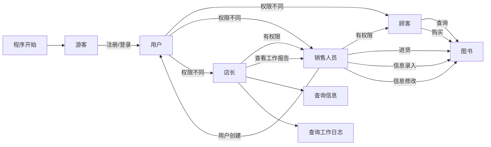
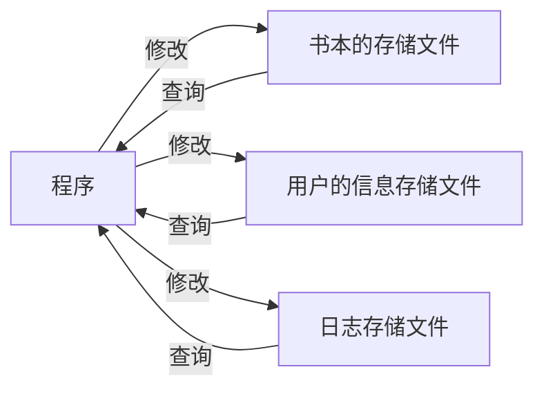

### 业务流图：

### 数据流图：

### 数据词典：

#### 用户（User）

- userID_int：用户唯一的 ID，两两不同，是 int 便于操作，用于存储。 类型： `int`

- userID：用户唯一的 ID，是字符串，用于操作。类型 ：`char`

- userType：用户的类型，用于权限处理。 类型： `enum = {tourist, customer, employee, owner}`

- userPassword：用户的密码。类型：`char` 数组

- userName：用户名，类型：`char` 数组

#### 书本（Book）

- bookID：书本唯一的 ID，两两不同，用于存储。类型：`int`

- bookISBN：书本的 ISBN 号。类型：`char` 数组

- bookname：书本的名字。类型：`char` 数组

- bookAuthor：书本的作者。类型：`char` 数组

- bookKeyword：书本的关键字。类型：`char` 数组

- bookRemain：库存量。类型：`int`

- bookPrice：单价。类型：`double`

#### 销售信息（SaleInfo）

- SaleID：销售信息的 ID，两两不同且递增，用于存储。类型：`int`

- userID：操作用户的 ID。类型：`int`

- SaleType：销售的类型。类型：`enum = {buyin, sale}`

- SaleNum：销售的数量。类型：`int`

#### 员工工作操作信息（operatorInfo）

- operatorID：操作的 ID，两两不同且递增，用于存储。类型：`int`

- employeeID：员工的 ID。类型：`int`

- operatorType：操作的类型：创建用户/进货/图书信息录入，修改/查询图书/购买图书。类型：`enum = {createuser, buyin, bookinfo_in, bookInfo_upd, bookQuery, bookBuy}`。

- operator_toID：对应的操作的信息的 ID。

#### 日志信息（logInfo）

- logID：日志信息的 ID，两两不同且递增，用于存储。类型：`int`

- userID：操作的人的 ID。类型：`int`

- operatorType：操作的类型。

- operatorInfo：操作的信息。类型：`int`

### 功能说明
